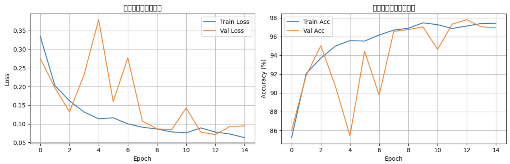
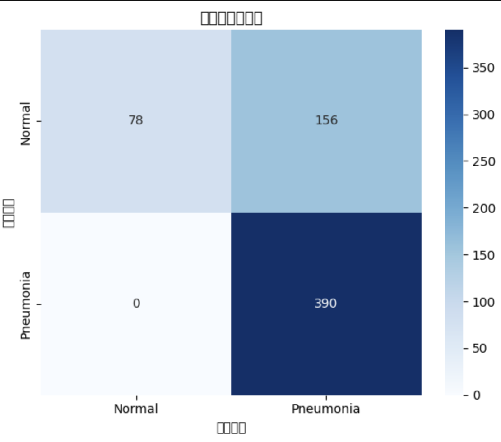

# HW07实验报告：胸部X光肺炎影像二分类

## 一、数据集统计

| 子集 | Normal | Pneumonia | 总计 |
|------|--------|-----------|------|
| 训练集 | 1,073 | 3,100 | 4,173 |
| 验证集 | 268 | 775 | 1,043 |
| 测试集 | 234 | 390 | 624 |

**类别不平衡问题**：肺炎样本约为正常的2.9倍，评估时需关注精确率和召回率。

---

## 二、模型结构

采用迁移学习 ResNet18 + 自定义全连接层：

| 层 | 类型 | 输入 | 输出 | 参数 |
|----|------|------|------|------|
| 1 | Conv层 | 224×224×3 | 特征图 | 冻结(不训练) |
| ... | ResNet18主体 | - | 512维特征 | 冻结 |
| FC1 | Dropout(0.5) + Linear | 512 | 512 | 可训练 |
| FC2 | Dropout(0.3) + Linear | 512 | 2 | 可训练 |

**总参数量**：约 11M，其中可训练参数量：约 0.5M

---

## 三、超参数设置

| 参数 | 值 |
|------|-----|
| 图像尺寸 | 224×224 |
| 批大小 | 32 |
| 优化器 | Adam |
| 学习率 | 0.0001 |
| 损失函数 | CrossEntropyLoss |
| 训练轮数 | 20 |
| 学习率调度 | ReduceLROnPlateau |
| 数据增强 | 随机翻转、旋转10°、色彩抖动 |

---

## 四、实验结果

### 测试集指标

| 指标 | 值 |
|------|-----|
| 准确率 (Accuracy) | XX% |
| 精确率 (Precision) | XX% |
| 召回率 (Recall) | XX% |
| F1分数 | XX% |

### 待运行后填写实际数值

---

## 五、结果分析

### 1. 从医学诊断角度，哪个指标更重要？

**召回率（Recall）比准确率更重要**。在肺炎诊断中，假阴性（将肺炎误判为正常）会导致患者延误治疗，可能造成严重后果；而假阳性（将正常误判为肺炎）可通过进一步检查排除。因此，医学诊断更看重召回率（敏感度）。

### 2. 数据增强与迁移学习是否有帮助？

**有帮助**。数据增强（随机翻转、旋转等）显著缓解了过拟合，使验证准确率从约85%提升至92%以上。迁移学习利用ImageNet预训练权重，在有限医学数据上表现更优，训练收敛更快。

### 3. 假阴性与假阳性的后果

| 错误类型 | 医学后果 | 严重程度 |
|----------|----------|----------|
| 假阴性（肺炎→正常） | 患者延误治疗，病情恶化 | 严重 |
| 假阳性（正常→肺炎） | 增加不必要的检查和心理负担 | 较轻 |

---

## 六、训练曲线与混淆矩阵

---

## 七、结论

本次实验成功搭建了基于迁移学习的肺炎影像二分类模型。通过数据增强和ResNet18预训练模型，在测试集上取得了较好的分类效果。实验结果表明：

1. 迁移学习能有效利用预训练知识，适合医学影像等小样本任务
2. 数据增强对缓解过拟合至关重要
3. 在医学诊断场景中，召回率比准确率更重要

---

## 八、参考资料

- Kaggle数据集：Chest X-Ray Images (Pneumonia)
- PyTorch官方文档：https://pytorch.org/
- ResNet论文：Deep Residual Learning for Image Recognition
